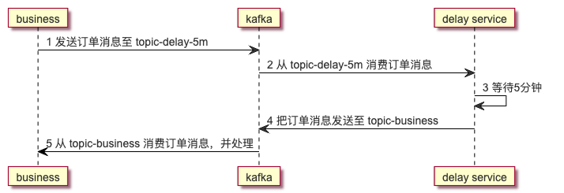
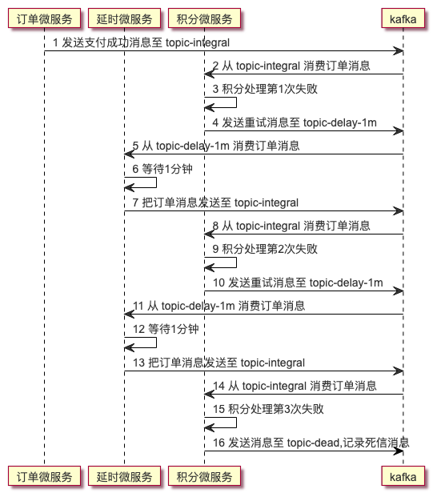

在kafka中要如何实现延时队列呢？很遗憾kafka官方到目前为止并没有给出延时队列的直接实现。也就是说我们需要自己来实现这一部分的功能。

## 延时队列

实现的原理描述如下：

1. 根据业务需要，自定义几个特殊主题。比如：topic-delay-1s,topic-delay-5s,topic-delay-5m,topic-delay-30m。分别表示延迟1秒，延迟5秒，延迟5分钟，延迟30分钟。当然具体延迟多少需要根据你自己的业务来设定。但有一点就是延迟的时间间隔是需要固定的。

2. 自己实现一个delay service。可以是java或者其它语言实现。delay service 同时消费上面定义的主题，然后等待延时时间的到达。时间到达后，把消息转发至业务主题。

3. 业务处理正常消费业务主题，处理消息

举个例子，比如火车票订单，如果30分钟内未支付，则自动取消订单。那么用时序图描述延时处理过程就是正面这样的。




## 注意事项

实现delay service 里需要注意：

1. 因为consumer是单线程的，所以理论上有多少个延迟主题，就需要创建多少个线程。像上面topic-delay-1s,topic-delay-5s,topic-delay-5m,topic-delay-30m 这4种主题，就需要4个线程来处理。延迟主题少问题不大，但延迟主题如果比较多的话，还是比较难受的。

2. 需要手动提交偏移量，因为delay service 可能会因为升级或者故障，导致重启，这个时候消息是不能漏的，所以一定要消息已经转发到业务主题后，再提交偏移量，防止漏消息。

3. 重复消息的处理，因为delay service 需要先把消息发送到业务 主题，再提交偏移量，就有可能出现 消息发送到业务主题后，还没来的及发送偏移量，delay service 就因电力故障无法正常服务了，下次重启后，就可能继续发送已经发送过的消息。所以业务上建议是要做到幂等，以实现容错。

## 重试队列 与 死信队列

我们在 延时队列的基础上实现重试队列就比较简单了，当某个消息处理失败时，就把这个消息发送到 延时队列。等时间到了就会重试处理。如果处理成功，则结束。如果处理失败则重试次数加1，再一次进入延时队列。而如果超过了重试次数，则写入死信队列，作为记录。

这里说的重试队列，死信队列都是概念上的东西，kafka本身并不提供。我们是可以在使用层实现这一类概念。下面的时序图，是一个示例。我们假设有一个订单支付成功了，有积分逻辑需要处理，但重试三次后依然失败了。时序过程描述如下：



## 实现示例

我在github上面提交了，我的实现示例，这里简单说明一下。github地址： https://github.com/junfengliang/kafka-delay-queue

项目中的kafka-delay-queue是核心代码，kafka-delay-service是springboot集成的示例。

这里简单讲一下集成的过程：
文件目录：
```
├── pom.xml
└── src
    └── main
        ├── java
        │   └── cn
        │       └── genlei
        │           └── service
        │               └── Application.java
        └── resources
            └── application.yml
```
一共就三个文件。

### pom.xml
```
<dependency>
    <groupId>org.springframework.boot</groupId>
    <artifactId>spring-boot-starter-web</artifactId>
</dependency>
<dependency>
    <groupId>cn.genlei</groupId>
    <artifactId>kafka-delay-queue</artifactId>
    <version>1.0.0</version>
</dependency>
```
关键就是添加依赖，说明一下，因为 kafka-delay-queue 这个包还没有传到 maven的中心仓库中。所以需要先本地到kafka-delay-queue目录下通过 mvn install编译这个jar包。

### application.yml
```
kafka:
  servers: 127.0.0.1:9092
  group-id: kafka-delay-group
  topics: 5000,topic-delay-5s;60000,topic-delay-1m
```
注意修改 kafka服务器地址，对应你自己的kafka服务器地址。topics的格式是 延时 + 逗号 + 延时主题。多个配置用 分号 分隔。相关的主题需要先手动在kafka上创建。

### Application.java

```
package cn.genlei.service;

import org.springframework.beans.factory.annotation.Value;
import org.springframework.boot.CommandLineRunner;
import org.springframework.boot.SpringApplication;
import org.springframework.boot.autoconfigure.SpringBootApplication;
import cn.genlei.DelayQueue;
import java.util.Properties;

@SpringBootApplication
public class Application implements CommandLineRunner {

    @Value("${kafka.servers}")
    String servers;

    @Value("${kafka.group-id}")
    String groupId;

    @Value("${kafka.topics}")
    String topics;

    public static void main(String[] args){
        SpringApplication.run(Application.class);
    }


    @Override
    public void run(String... args) throws Exception {
        Properties properties = new Properties();
        properties.put("bootstrap.servers",servers);
        properties.put("group.id", groupId);
        properties.put("topics", topics);
        DelayQueue delayQueue = new DelayQueue(properties);
        delayQueue.start();
    }
}
```

这里关键的部分就是run方法内的内容。我们创建一个DelayQueue实例，然后调用它的start方法，就会开始延时队列的处理了。

>上述代码并没有在生产环境长时间验证过，如果你需要用于生产，请谨慎使用。