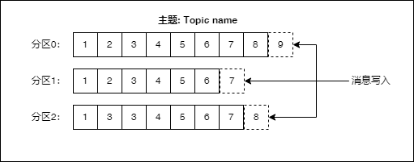
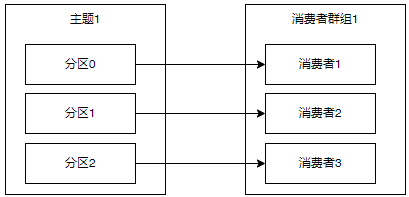
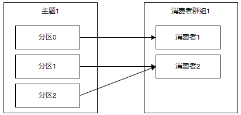
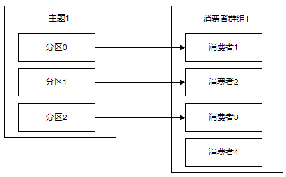
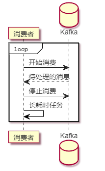

## 简介

之前在一个项目里，遇到一个问题：当时是消费者有两个节点，其中一个节点能消费到消息，另一个节点就一直消费不到消息。当时也是对kafka不太了解，也正因为这个问题，使我对kafka的分区有了更深入的理解。我们先来看几个问题：
1. “消费组中的消费者个数如果超过topic的分区，那么就会有消费者消费不到数据” 这句话是否正确？ 如果正确，那么有没有什么hack的手段？
2. topic的分区数是否可以增加？如果可以怎么增加？如果不可以，那又是为什么？
3. topic的分区数是否可以减少？如果可以怎么减少？如果不可以，那又是为什么？
4. 创建topic时如何选择合适的分区数？
5. Kafka有哪几处地方有分区分配的概念？简述大致的过程及原理。
6.生产者写入消息里，是如何确定一个消息对应的分区的？

希望通过这篇文章的介绍，能让大家对kafka的分区有一个清楚的理解，也能很好的回答上面的问题。

## 概念
写入消息和消费消息时都需要指定主题(Topic)，消息是按主题来分类的。每个主题可以有多个分区(Partition)，每个分区同一时间只能被一个消费者消费。通过把多个分区分散到多个服务器上，可以提高系统的服务能力。消息以追加的方式写入分区，然后以先进先出的顺序读取。下图是主题内有多个分区的消息写入示意图：



>由于一个主题内包含了多个分区，因此无法在整个主题范围内保证消息的顺序，但可以保证消息在单个分区内的顺序。那么我如果希望实现主题内消息的顺序要怎么办呢？一个简单的方法就是只使用一个分区。

## 分区消费
每个分区，对于每一个消息者群组，同一时间只能有一个消费者。有以下三种对应的情况：
1. 分区数量和消费者数量刚好相等




2. 分区数量大于消费者数量刚



>分区数量大于消费者数量时，一个消费者会消费来自多个分区的数据。

3. 分区数量小于消费者数量



> 分区数量小于消费者数量时，会有消费者处于无分区消费的情况，这个无分区消费的消费者就处于空闲状态了。这种情况下增加消费者并不能提高消费的处理速度。

那么问题来了，如果一个消息的消费是比较耗时的，那要怎么办呢？比如说：有一个影片转码系统，一个长视频的转码可能需要一个小时，甚至更长的时间，我们把待处理的视频消息放进了kafka。这个时候我们就希望能充分的使用多个消费者来提高整个系统的转码能力。这种情况我们需要做一些特殊处理，每个消费者，消费到一个消息后，在开始转码的任务前先停止消费。这样有新的消息到达时，就会分配给其它消费者。直到转码任务结束，可以开始下一个转码任务后，再开始消费。通过这样的方式实现消费者的资源充分利用。值得注意的是，这样的处理方法，只适用于需要长时间处理消息的情况，如果处理一个消息所花的时间是很短的，则不应该这样处理。下面的时序图可以帮助理解：




## 分区管理

1. 创建主题时，可以通过 --partitions 参数指定分区数量

```
$ ./bin/kafka-topics.sh --bootstrap-server 127.0.0.1:9092 --create --topic test-topic \
        --partitions 1 --replication-factor 1
```

2. 修改主题时，可以通过 --partitions 参数增加分区数量

```
$ ./bin/kafka-topics.sh --bootstrap-server 127.0.0.1:9092 --alter --topic test-topic \
        --partitions 4
```

> 修改分区数量时，不能比原来的分区数要小，因为减少分区，kafka不知道要如何分区里的数据。如果一定要不顾一切代价，减少某个主题分区的数量，那就只能把这个主题先删除掉，再重新创建。这样一来，主题里原有的数据就全部丢失了。

## 分区分配

除了主题创建和主题修改时，我们能控制分区数量外，在生产者和消费者的API使用过程中，也会存在分区的分配过程。

### 生产者
既然有分区，那么当生产者写入一条新的消息时，分区是如何确定的呢？我们直接看 ProducerRecord.java 的源代码中 ProducerRecord 构造函数的定义。下面是从 kafka-clients 2.7.0的代码中提取的片段：

```
public ProducerRecord(String topic, Integer partition, K key, V value)
public ProducerRecord(String topic, K key, V value)
public ProducerRecord(String topic, V value)
```
在这里我截取其中三个构造函数，从上面的第一个构造函数可以看到，我们可以直接指定一个消息的 partition, 它的类型是Integer。除了直接指定partition，还可以在创建Producer的时候，通过 partitioner.class 配置，指定自定义的分区器。分区器需要实现 Partitioner 接口。

在默认的情况下，如果指定了 key, 那么Kafka会通过key,取它的哈希值，再对分区总数取模，分配到对应的分区。因此 对于同样的key, 在分区数量不变的情况下，总是会被分配到同一个分区。

> 特别注意，不要给所有的消息都指定同样的非空key, 这样一来所有的消息都会被分配到同一个分区，这样分区也就没有意义了。

如果没有指定key, 即 key==null 的情况下，kafka 会使用随机算法，给每一批消息分配一个随机的分区。如果你想使用 RoundRobin 轮询的方式来指定分区，可以通过修改 partitioner.class 的配置修改分区器的配置，参考代码：

```
Properties props = new Properties();
props.put("bootstrap.servers", "127.0.0.1:9092");
props.put("key.serializer", "org.apache.kafka.common.serialization.StringSerializer");
props.put("value.serializer", "org.apache.kafka.common.serialization.StringSerializer");

// ** 重点就是下面这一行 **
props.put("partitioner.class","org.apache.kafka.clients.producer.RoundRobinPartitioner");

KafkaProducer<String, String> producer = new KafkaProducer<>(props);
```

从上面的分析我们知道，所有的指定消息对应的分区的逻辑都是在 kafka client 端实现的。

### 消费者
正如前文所说：每个分区同一时间只能被一个消费者消费。那么问题来了，在一个消费者群组内有多个消费者的时候，kafka是如何给消费者分配分区的呢？在消费的配置项里，有一项是：partition.assignment.strategy 就是用来指定分区分配策略的。默认的情况下使用的是 org.apache.kafka.clients.consumer.RangeAssignor 。简单的说就是按范围来分配。我从日志中看到如下的信息：
```
Notifying assignor about the new Assignment(partitions=[TEST1-4, TEST1-5, TEST1-6, TEST1-7])
```
我们可以看到kafka分配4个连续的分区给这个消费者。

> 需要注意的是，当有新的消费者加入，或者有消费者失效，kafka就会触发分区再均衡，也就是把一个分区的消费权从一个消费者转移给另一个消费者。在再均衡期间，消费者无法读取消息，整个群组会出现一小段时间的不可用。


## 问答
我们回过头来看看前面的问题，答案已经在上面的正文里给出来，这里简要的答复一下：
1. “消费组中的消费者个数如果超过topic的分区，那么就会有消费者消费不到数据” 这句话是否正确？ 如果正确，那么有没有什么hack的手段？

> 回答：正确，每个分区同一时间只能被一个消费者消费。hack的手段就是消费者消费到消息后，在处理消息前，先停止消费，处理完了再进行下一次消费，只适用于并发小，消息处理时间长的情况。

2. topic的分区数是否可以增加？如果可以怎么增加？如果不可以，那又是为什么？

> 回答：可以， 通过 kafka-topics.sh 脚本修改分区数量

3. topic的分区数是否可以减少？如果可以怎么减少？如果不可以，那又是为什么？

> 回答：不可以，因为分区数量减少后，kafka无法处理已经存在的数据。如果一定要不顾一切代价，减少某个主题分区的数量，那就只能把这个主题先删除掉，再重新创建。这样一来，主题里原有的数据就全部丢失了。

4. 创建 topic 时如何选择合适的分区数？

>  回答：这个问题特别开放，回答起来还是蛮模糊的，说几点供大家参考。1. 如果你不知道怎么选择，那么1也许是不错的选择。 2. 如果你发现多个消费者中有人空闲了，那么分区数量应该大于等于一个消费者群组下的消费者的数量。3. 如果你想充分发挥多个broker的性能，那么分区数量应该大于等于broker的数量

5. Kafka有哪几处地方有分区分配的概念？简述大致的过程及原理。

> 回答：1. 生产者发送消息时，需要给消息分配一个指定的分区；在默认的情况下，如果指定了 key, 那么Kafka会通过key,取它的哈希值，再对分区总数取模，分配到对应的分区。如果没有指定key, 即 key==null 的情况下，kafka 会使用随机算法，给每一批消息分配一个随机的分区。也可以自定义分区分配的方案。2. 消费者消费消息时，会给每个消费者分配对应的分区，默认按分区范围来分配，尽量分配连续的分区编号给同一个消费者。当有新的消费者加入，或者有消费者失效，kafka就会触发分区再均衡，也就是把一个分区的消费权从一个消费者转移给另一个消费者

6. 生产者写入消息里，是如何确定一个消息对应的分区的？

>回答：在默认的情况下，如果指定了 key, 那么Kafka会通过key,取它的哈希值，再对分区总数取模，分配到对应的分区。如果没有指定key, 即 key==null 的情况下，kafka 会使用随机算法，给每一批消息分配一个随机的分区。也可以自定义分区分配的方案。

## 总结

分区是kafka的重要特性，了解其工作模式及原理还是对于问题排查还是很有必要的。合适的分区数量对于提高消息吞吐量，同时消费的能力至关重要。

### 参考资料
1. kafka-clients 2.7.0 源代码
2. 《kafka权威指南》
