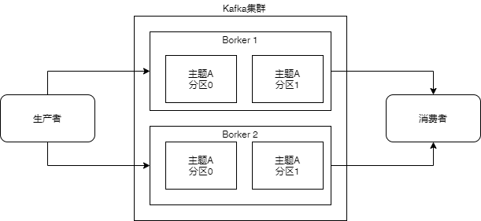
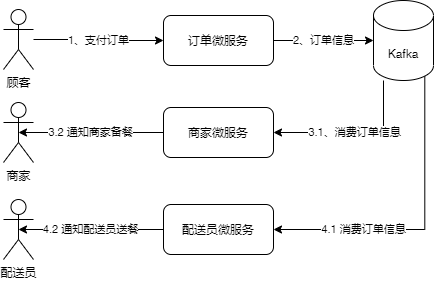

## kafka简介
我们先问两个问题：
1. kafka是什么？
2. kafka能做什么？

按kafka官网的说法，Apache Kafka 是一个开源分布式事件流平台，它被数千家公司用于高性能数据管道、流分析、数据集成和关键任务应用。

按个人理解，kafka是一个开源的，流行的消息队列。Kafka是Apache基金会基于宽松的Apache License v2 开源协议开源的软件，可以免费用于商业应用。
Kafka是流行的，广泛在业界使用的。我们看国内几个大的云服务供应商提供的消息队列产品：

  云服务 | Kafka | RabbitMQ | RocketMQ | Pulsar
 --|--|--|--|--
 阿里云 | 支持|支持|支持|N
 华为云 | 支持|支持|支持|N
 腾讯云 | 支持|支持|支持|支持
 Ucloud优刻得 | 支持 |N|N|N
 青云QingCloud| 支持 |支持|N|N

从上面的表格就可以看出，kafka已经足够流行了。

Kafka属于消息队列，消息队列的作用主要就是 解耦，削峰。

## kafka结构
Kafka的逻辑结构请看下图：

### 生产者 和 消费者
生产者是指产生消息的实体，通常是业务的上游模块产生消息。消费者是指消费消息的实体，通常是业务的下游模块消费消息。生产者把消息写入kafka服务器集群，消费者从kafka服务器集群中获取消息，生产者和消费者之间没有直接的联系，生产者不知道消息被哪些消费者消费了，这样一来通过kafka就实现了生产者与消费者之间的解耦。

### 消息
Kafka的数据单元被称为消息。消息由字节组成，若干个字节表示一条消息。一条消息在kafka里就是一条记录。通常在实际项目中用一个Json对象表达一条消息。消息由生产者产生，生产者产生消息后，把消息发送到kafka服务器，消费者从kafka服务器中消费消息。

### 集群 和 Broker
一个Kafka集群由多台服务器组成，最少3台。每台服务器上运行一个Borker实例，Broker就是一个独立的Kafka服务器。

### 主题 和 分区
写入消息和消费消息时都需要指定主题，消息是按主题来分类的。每个主题可以有多个分区，每个分区同一时间只能被一个消费者消费。通过把多个分区分散到多个服务器上，可以提高系统的服务能力。

## 应用举例
假设有一个外卖系统，系统由订单微服务，商家微服务，配送员微服务成。那么一次交易过程的数据流如下图所示。

1. 顾客支付订单时，由订单微服务处理，订单微服务作为生产者把一个新的订单信息这个消息写入kafka服务器。
2. 商家微服务从kafka服务器中消费订单信息，并通知商家备餐。
3. 配送员微服务从kafka服务器中消费订单信息，并通知配送员送餐。

在这样一个示例中，我们就实现了 订单微服务，商家微服务，配送员微服 的解耦。